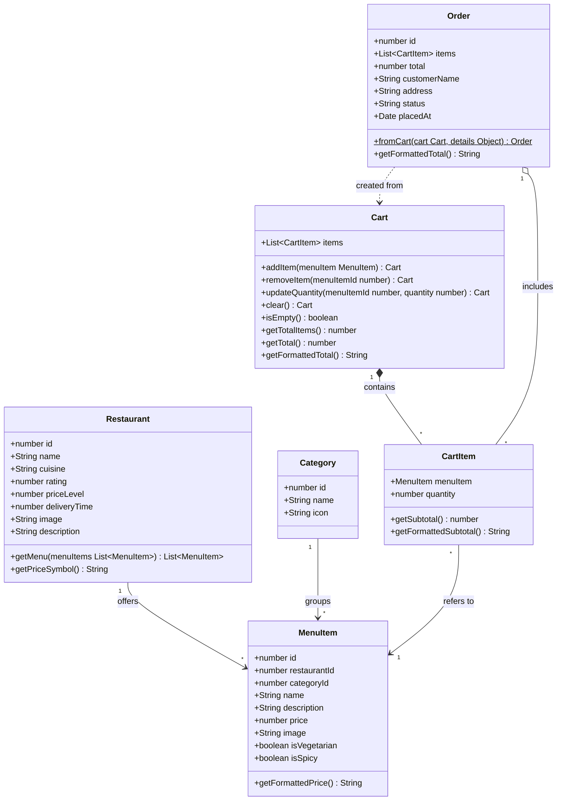

# GoFoods Class Diagram

```mermaid
classDiagram
    class Category {
        +number id
        +String name
        +String icon
    }

    class Restaurant {
        +number id
        +String name
        +String cuisine
        +number rating
        +number priceLevel
        +number deliveryTime
        +String image
        +String description
        +getMenu(menuItems List~MenuItem~) List~MenuItem~
        +getPriceSymbol() String
    }

    class MenuItem {
        +number id
        +number restaurantId
        +number categoryId
        +String name
        +String description
        +number price
        +String image
        +boolean isVegetarian
        +boolean isSpicy
        +getFormattedPrice() String
    }

    class CartItem {
        +MenuItem menuItem
        +number quantity
        +getSubtotal() number
        +getFormattedSubtotal() String
    }

    class Cart {
        +List~CartItem~ items
        +addItem(menuItem MenuItem) Cart
        +removeItem(menuItemId number) Cart
        +updateQuantity(menuItemId number, quantity number) Cart
        +clear() Cart
        +isEmpty() boolean
        +getTotalItems() number
        +getTotal() number
        +getFormattedTotal() String
    }

    class Order {
        +number id
        +List~CartItem~ items
        +number total
        +String customerName
        +String address
        +String status
        +Date placedAt
        +fromCart(cart Cart, details Object)$ Order
        +getFormattedTotal() String
    }

    Restaurant "1" --> "*" MenuItem : offers
    Category "1" --> "*" MenuItem : groups
    Cart "1" *-- "*" CartItem : contains
    CartItem "*" --> "1" MenuItem : refers to
    Order "1" o-- "*" CartItem : includes
    Order ..> Cart : created from
```